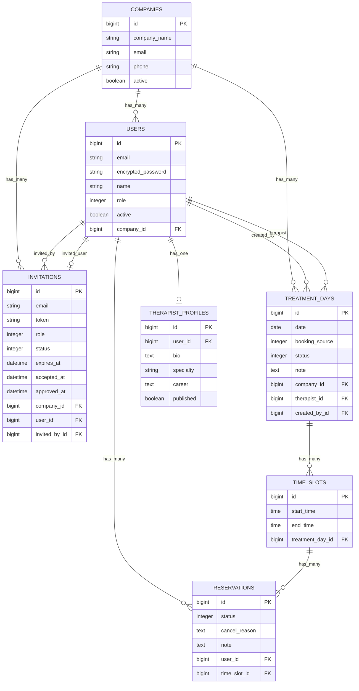

# 福利厚生マッサージ予約管理アプリ

## アプリ概要
企業向け福利厚生マッサージの予約を管理する Rails アプリです。  
管理者、施術者、会社責任者、利用者ごとに画面と操作範囲を分け、招待制でユーザー登録を行います。

## 想定ユーザー
- 管理者
- 施術者
- 会社責任者
- 利用者

## 主な機能
- Devise を使った認証
- 招待URL発行
- 招待経由の登録申請
- 管理者承認後のログイン有効化
- 会社管理
- 施術日管理
- 時間枠管理
- 予約作成 / キャンセル
- 施術日中止 / 再開
- 施術者プロフィール管理
- role に応じた画面制御と認可制御

## 使用技術
- Ruby 3.2.0
- Ruby on Rails 7.1
- MySQL（development / test）
- PostgreSQL（production）
- Devise
- RSpec
- FactoryBot
- Importmap
- カスタム CSS

## 権限
### 管理者
- 会社管理
- 招待管理
- 施術日管理
- 予約確認
- 施術者プロフィール一覧 / 詳細確認
- 招待承認

### 施術者
- 自分の担当時間枠と予約確認
- 自分の施術者プロフィール作成 / 編集

### 会社責任者
- 自社施術日の作成 / 更新 / 中止 / 再開
- 自社予約の確認

### 利用者
- 自社の予約可能枠確認
- 自分の予約作成 / キャンセル / 詳細確認
- 公開済み施術者プロフィール閲覧

## テーブル設計

### users テーブル

| Column | Type | Options |
| --- | --- | --- |
| email | string | null: false, default: "", unique: true |
| encrypted_password | string | null: false, default: "" |
| name | string | null: false |
| role | integer | null: false |
| active | boolean | null: false, default: true |
| company_id | references | null: true, foreign_key: true |
| reset_password_token | string | unique: true |
| reset_password_sent_at | datetime | null: true |
| remember_created_at | datetime | null: true |

#### Association
- belongs_to :company, optional: true
- has_many :sent_invitations, class_name: "Invitation", foreign_key: :invited_by_id
- has_one :invitation, dependent: :nullify
- has_many :created_treatment_days, class_name: "TreatmentDay", foreign_key: :created_by_id
- has_many :assigned_treatment_days, class_name: "TreatmentDay", foreign_key: :therapist_id
- has_many :reservations
- has_one :therapist_profile, dependent: :destroy

### companies テーブル

| Column | Type | Options |
| --- | --- | --- |
| company_name | string | null: false |
| email | string | null: false |
| phone | string | null: false |
| active | boolean | null: false, default: true |

#### Association
- has_many :users
- has_many :invitations, dependent: :destroy
- has_many :treatment_days

### invitations テーブル

| Column | Type | Options |
| --- | --- | --- |
| email | string | null: false |
| token | string | null: false, unique: true |
| role | integer | null: false |
| status | integer | null: false, default: 0 |
| expires_at | datetime | null: false |
| accepted_at | datetime | null: true |
| approved_at | datetime | null: true |
| company_id | references | null: true, foreign_key: true |
| user_id | references | null: true, foreign_key: true |
| invited_by_id | references | null: false, foreign_key: { to_table: :users } |

#### Association
- belongs_to :company, optional: true
- belongs_to :user, optional: true
- belongs_to :invited_by, class_name: "User"

### therapist_profiles テーブル

| Column | Type | Options |
| --- | --- | --- |
| user_id | references | null: false, foreign_key: true, unique: true |
| bio | text | null: false |
| specialty | string | null: false |
| career | text | null: false |
| published | boolean | null: false, default: false |

#### Association
- belongs_to :user

### treatment_days テーブル

| Column | Type | Options |
| --- | --- | --- |
| date | date | null: false |
| booking_source | integer | null: false |
| status | integer | null: false, default: 0 |
| note | text | null: true |
| company_id | references | null: false, foreign_key: true |
| therapist_id | references | null: true, foreign_key: { to_table: :users } |
| created_by_id | references | null: false, foreign_key: { to_table: :users } |

#### Association
- belongs_to :company
- belongs_to :therapist, class_name: "User", optional: true
- belongs_to :created_by, class_name: "User"
- has_many :time_slots

### time_slots テーブル

| Column | Type | Options |
| --- | --- | --- |
| start_time | time | null: false |
| end_time | time | null: false |
| treatment_day_id | references | null: false, foreign_key: true |

#### Association
- belongs_to :treatment_day
- has_many :reservations

### reservations テーブル

| Column | Type | Options |
| --- | --- | --- |
| status | integer | null: false, default: 0 |
| cancel_reason | text | null: true |
| note | text | null: true |
| user_id | references | null: false, foreign_key: true |
| time_slot_id | references | null: false, foreign_key: true |

#### Association
- belongs_to :user
- belongs_to :time_slot
- has_one :treatment_day, through: :time_slot

## ER図


## 招待フロー
1. 管理者が招待を作成する
2. 招待されたユーザーが URL から登録申請する
3. 申請ユーザーは `active: false` で作成される
4. 管理者が承認すると `active: true` になりログイン可能になる

## 設計ルール

### ユーザー権限
- `admin` と `therapist` は `company_id` を持たない
- `company_manager` と `employee` は `company_id` 必須
- `admin` は招待経由では作成しない

### 予約ルール
- 利用者は所属会社の予約可能枠のみ予約できる
- 1つの `time_slot` に対して有効な予約は1件まで
- `cancelled` の予約は再予約の妨げにしない

### 施術日・時間枠ルール
- 施術日は会社単位で作成する
- 時間枠は施術日に紐づく
- 同一施術日内で同じ時間帯の時間枠を重複作成できない
- 施術日を中止すると、その施術日の `reserved` 予約も `cancelled` になる
- 中止済み施術日は再開できる

### 施術者プロフィールルール
- プロフィールは施術者本人のみ作成 / 編集できる
- 管理者は一覧 / 詳細確認のみ行う
- 公開済みプロフィールのみ一般ユーザーに表示する

## Enum定義
```ruby
# User
enum role: {
  admin: 0,
  therapist: 1,
  company_manager: 2,
  employee: 3
}

# Invitation
enum role: {
  admin: 0,
  therapist: 1,
  company_manager: 2,
  employee: 3
}

enum status: {
  pending: 0,
  accepted: 1,
  approved: 2,
  expired: 3
}

# TreatmentDay.booking_source
enum booking_source: {
  app: 0,
  phone: 1,
  email: 2,
  admin_input: 3
}

# TreatmentDay.status
enum status: {
  pending: 0,
  confirmed: 1,
  cancelled: 2
}

# Reservation.status
enum status: {
  reserved: 0,
  cancelled: 1,
  completed: 2
}
```

## 初期管理者アカウント
招待機能では `admin` を作成しません。  
初期管理者は Rails console または `db:seed` で作成します。

`db/seeds.rb` では以下の環境変数が設定されている場合に管理者を作成します。

- `ADMIN_EMAIL`
- `ADMIN_PASSWORD`

## 今後の課題
- 承認通知機能の追加
- カレンダーUIの検討
- 施術者プロフィール画像の追加
- README と実画面キャプチャの整備
